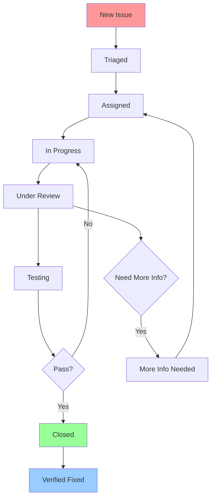

# CarMarket365 Translation System - Issue Tracking Framework

## Issue Classification System

### Priority Levels

#### 🔴 Critical Priority
**Definition**: Issues that block core functionality, cause system crashes, or violate legal compliance requirements.

**Response Time**: Immediate (within 2 hours)
**Resolution Target**: Same day
**Escalation**: Automatic to development lead and product manager

**Examples**:
- Translation system completely non-functional
- Critical hardcoded strings in production
- Legal compliance violations (GDPR, accessibility)
- Major security vulnerabilities in translation handling
- Complete page rendering failures

#### 🟠 High Priority  
**Definition**: Issues that significantly impact user experience or break important functionality.

**Response Time**: Within 8 hours
**Resolution Target**: Within 48 hours
**Escalation**: To development lead if not resolved within SLA

**Examples**:
- Missing translations on key pages
- Language switching not working
- Form submissions failing in specific languages
- Major layout breaking with certain translations
- Performance degradation >20% from baseline

#### 🟡 Medium Priority
**Definition**: Issues that affect user experience but don't break core functionality.

**Response Time**: Within 24 hours
**Resolution Target**: Within 1 week
**Escalation**: Weekly review with product team

**Examples**:
- Minor translation inaccuracies
- Layout issues on specific screen sizes
- Non-critical performance issues
- Missing translations on secondary pages
- Inconsistent terminology across contexts

#### 🟢 Low Priority
**Definition**: Minor issues, cosmetic problems, or enhancement requests.

**Response Time**: Within 72 hours
**Resolution Target**: Next release cycle
**Escalation**: Monthly review

**Examples**:
- Stylistic translation improvements
- Minor accessibility enhancements
- Performance optimizations <5% impact
- Documentation updates
- Code refactoring opportunities

### Issue Categories

#### 🌐 Translation Issues
**T01 - Missing Translation**: Required translation key has no value
**T02 - Incorrect Translation**: Translation is wrong or inaccurate
**T03 - Incomplete Translation**: Partial translation or placeholder text
**T04 - Inconsistent Translation**: Same concept translated differently
**T05 - Cultural Inappropriateness**: Content not suitable for target culture
**T06 - Technical Translation Error**: Technical terms incorrectly translated

#### 🎨 Layout Issues  
**L01 - Text Overflow**: Text exceeds container boundaries
**L02 - Button Sizing**: Buttons too small for translated text
**L03 - Responsive Breakage**: Layout breaks on specific screen sizes
**L04 - Alignment Issues**: Text or elements misaligned
**L05 - Spacing Problems**: Incorrect margins/padding with translations
**L06 - Font Rendering**: Character display issues

#### ⚙️ Functionality Issues
**F01 - Language Switching Failure**: Cannot change languages
**F02 - Form Submission Error**: Forms fail with localized content
**F03 - Search Malfunction**: Search doesn't work with local language
**F04 - Navigation Broken**: Menu/navigation issues
**F05 - Dynamic Content Error**: Dynamic content not translating
**F06 - State Management Issue**: Language state not maintained

#### ⚡ Performance Issues  
**P01 - Slow Loading**: Translation loading exceeds performance thresholds
**P02 - Memory Leak**: Memory usage increases during language switching
**P03 - Network Inefficiency**: Excessive network requests
**P04 - Rendering Delay**: Visible delay in content updates
**P05 - Bundle Size**: Translation files too large
**P06 - Caching Problems**: Translation caching not working properly

#### ♿ Accessibility Issues
**A01 - Screen Reader**: Screen reader compatibility problems
**A02 - Keyboard Navigation**: Keyboard access issues with translations
**A03 - Color Contrast**: Insufficient contrast with translated text
**A04 - Focus Management**: Focus issues during language switching
**A05 - Alternative Text**: Missing or incorrect alt text translations
**A06 - ARIA Labels**: Missing or incorrect ARIA labels

#### 🖥️ Browser Compatibility Issues
**B01 - Chrome Issues**: Problems specific to Chrome browser
**B02 - Firefox Issues**: Problems specific to Firefox browser
**B03 - Safari Issues**: Problems specific to Safari browser
**B04 - Edge Issues**: Problems specific to Edge browser
**B05 - Mobile Browser**: Mobile-specific browser issues
**B06 - Cross-Browser Inconsistency**: Different behavior across browsers

## Issue Reporting Templates

### Standard Issue Report Template

```markdown
# Issue Report

## Basic Information
**Issue ID**: TR-{YYYY}-{MM}-{DD}-{###}
**Reported By**: {Name}
**Report Date**: {YYYY-MM-DD}
**Last Updated**: {YYYY-MM-DD}

## Issue Classification
**Priority**: [ ] Critical [ ] High [ ] Medium [ ] Low
**Category**: [ ] Translation [ ] Layout [ ] Functionality [ ] Performance [ ] Accessibility [ ] Browser
**Sub-Category**: {Specific code from categories above}

## Affected Components
**Languages Affected**: [ ] EN [ ] MK [ ] SQ [ ] SL [ ] LV [ ] RU
**Pages/Components**: {List specific pages or components}
**Browsers**: [ ] Chrome [ ] Firefox [ ] Safari [ ] Edge [ ] Mobile
**Devices**: [ ] Desktop [ ] Tablet [ ] Mobile

## Issue Description
### Summary
{Brief, clear description of the issue}

### Steps to Reproduce
1. {Step 1}
2. {Step 2}
3. {Step 3}

### Expected Behavior
{What should happen}

### Actual Behavior
{What actually happens}

### Screenshots/Evidence
{Attach screenshots, console logs, or other evidence}

## Technical Details
**URL**: {Full URL where issue occurs}
**Browser Version**: {Version info}
**Screen Resolution**: {Resolution}
**Operating System**: {OS and version}

**Console Errors**:
```
{Any console errors or warnings}
```

**Network Issues**:
{Any network-related problems}

## Impact Assessment
**User Experience Impact**: [ ] Blocking [ ] Major [ ] Minor [ ] Cosmetic
**Business Impact**: [ ] Revenue Loss [ ] Compliance Risk [ ] User Retention [ ] Brand Image
**Frequency**: [ ] Always [ ] Often [ ] Sometimes [ ] Rarely
**Workaround Available**: [ ] Yes [ ] No

### Affected User Base
**Estimated % of Users**: {Percentage}
**Specific User Types**: {Private, Dealer, Admin, etc.}
**Geographic Impact**: {Which countries/regions}

## Resolution Information
**Assigned To**: {Team member name}
**Status**: [ ] Open [ ] In Progress [ ] Testing [ ] Closed
**Target Resolution Date**: {YYYY-MM-DD}
**Actual Resolution Date**: {YYYY-MM-DD}

### Root Cause Analysis
{Description of underlying cause}

### Solution Implemented
{Description of fix applied}

### Testing Performed
{List of tests conducted to verify fix}

## Quality Assurance
**Verified By**: {QA tester name}
**Verification Date**: {YYYY-MM-DD}
**Cross-Browser Tested**: [ ] Yes [ ] No
**All Languages Tested**: [ ] Yes [ ] No
**Regression Tests Passed**: [ ] Yes [ ] No

### Additional Notes
{Any other relevant information}
```

### Critical Issue Template (Expedited)

```markdown
# CRITICAL ISSUE - URGENT ATTENTION REQUIRED

## 🔴 CRITICAL ISSUE ALERT
**Issue ID**: TR-CRITICAL-{YYYY}-{MM}-{DD}-{###}
**Discovered**: {Date and Time}
**Reporter**: {Name}
**On-Call Engineer Notified**: {Name and Time}

## Immediate Impact
**System Status**: [ ] Complete Failure [ ] Partial Failure [ ] Degraded Performance
**User Impact**: [ ] All Users [ ] Specific Languages [ ] Specific Features
**Revenue Impact**: [ ] Direct [ ] Indirect [ ] None
**Compliance Risk**: [ ] High [ ] Medium [ ] Low

## Quick Assessment
**Problem Summary**: {One-sentence description}
**Affected Languages**: {List}
**Affected Pages**: {List}
**Error Rate**: {Percentage or frequency}

## Emergency Response
**Response Team**: {Names}
**War Room Established**: [ ] Yes [ ] No
**Stakeholders Notified**: {List with timestamp}

## Immediate Actions Taken
1. {Action 1 - Timestamp}
2. {Action 2 - Timestamp}
3. {Action 3 - Timestamp}

## Status Updates
### Update 1 - {Timestamp}
{Status update}

### Update 2 - {Timestamp}
{Status update}

## Resolution
**Root Cause**: {Description}
**Fix Applied**: {Description}
**Verification**: {Tests performed}
**All Clear Time**: {Timestamp}

## Post-Incident
**Post-Mortem Required**: [ ] Yes [ ] No
**Process Improvements**: {List}
```

### Translation Quality Issue Template

```markdown
# Translation Quality Issue

## Issue Details
**Issue ID**: TR-QUALITY-{YYYY}-{MM}-{DD}-{###}
**Language**: {Specific language}
**Reporter**: {Name and role}
**Native Speaker Review**: [ ] Required [ ] Completed

## Translation Context
**Translation Key**: {Key path}
**Page/Component**: {Location}
**User Context**: {When/how user sees this}

**Current Translation**:
```
{Current text}
```

**Suggested Translation**:
```
{Improved text}
```

## Quality Issues
**Issue Type**: 
- [ ] Grammar Error
- [ ] Spelling Error
- [ ] Terminology Inconsistency
- [ ] Cultural Inappropriateness
- [ ] Technical Inaccuracy
- [ ] Style Inconsistency
- [ ] Formality Level
- [ ] Length Issue (too long/short)

## Linguistic Assessment
**Accuracy**: [ ] Correct [ ] Minor Issues [ ] Major Issues [ ] Incorrect
**Fluency**: [ ] Native-like [ ] Good [ ] Awkward [ ] Unnatural
**Cultural Fit**: [ ] Appropriate [ ] Minor Issues [ ] Major Issues [ ] Inappropriate

## Business Context
**Content Type**: [ ] Marketing [ ] Legal [ ] Technical [ ] UI [ ] Help
**Formality Level**: [ ] Formal [ ] Professional [ ] Casual [ ] Mixed
**Target Audience**: [ ] General Public [ ] Car Enthusiasts [ ] Dealers [ ] Professionals

## Expert Review
**Native Speaker**: {Name}
**Review Date**: {Date}
**Expertise**: [ ] Linguistics [ ] Automotive [ ] Legal [ ] Marketing
**Recommendation**: [ ] Accept [ ] Modify [ ] Reject

**Expert Comments**:
{Detailed feedback}

## Implementation
**Approved By**: {Name}
**Updated By**: {Developer}
**Testing**: [ ] Required [ ] Completed
**Related Issues**: {Links to related translation issues}
```

## Issue Workflow and Status Management

### Issue Lifecycle States



### Status Definitions

**New**: Issue just reported, awaiting triage
**Triaged**: Issue categorized and prioritized
**Assigned**: Issue assigned to team member
**In Progress**: Actively being worked on
**Under Review**: Code review or QA review in progress
**Testing**: Fix deployed to test environment
**More Info Needed**: Requires additional information
**Closed**: Issue resolved and verified
**Verified Fixed**: Final confirmation that issue is resolved

### Workflow Rules

1. **New → Triaged**: Must be done within 4 hours for critical, 24 hours for others
2. **Triaged → Assigned**: Must assign within SLA timeframes
3. **Assigned → In Progress**: Team member must acknowledge assignment
4. **In Progress → Under Review**: Code changes must be submitted for review
5. **Under Review → Testing**: All reviews approved
6. **Testing → Closed**: QA verification complete
7. **Closed → Verified Fixed**: Final stakeholder approval

## Issue Tracking Tools Integration

### GitHub Issues Labels

```yaml
Priority Labels:
- priority/critical (red)
- priority/high (orange)  
- priority/medium (yellow)
- priority/low (green)

Category Labels:
- category/translation (blue)
- category/layout (purple)
- category/functionality (teal)
- category/performance (brown)
- category/accessibility (pink)
- category/browser (gray)

Language Labels:
- lang/english (flag-en)
- lang/macedonian (flag-mk)
- lang/albanian (flag-sq)
- lang/slovenian (flag-sl)
- lang/latvian (flag-lv)
- lang/russian (flag-ru)

Status Labels:
- status/new
- status/triaged
- status/assigned
- status/in-progress
- status/under-review
- status/testing
- status/blocked
- status/closed
```

### Automated Issue Management

```javascript
// Example GitHub Actions workflow for issue management
name: Translation Issue Auto-Triage

on:
  issues:
    types: [opened, labeled]

jobs:
  auto-triage:
    runs-on: ubuntu-latest
    steps:
      - name: Auto-assign critical issues
        if: contains(github.event.issue.labels.*.name, 'priority/critical')
        run: |
          # Auto-assign to on-call engineer
          # Send notification to team
          # Create incident in monitoring system
          
      - name: Auto-label by content
        run: |
          # Analyze issue title/body for automatic labeling
          # Apply appropriate category and language labels
          
      - name: Set milestone
        run: |
          # Assign to appropriate milestone based on priority
```

## Metrics and Reporting

### Key Performance Indicators (KPIs)

#### Issue Resolution Metrics
- **Mean Time to Resolution (MTTR)** by priority level
- **First Response Time** by priority level  
- **Resolution Rate** (percentage resolved within SLA)
- **Reopen Rate** (percentage of issues reopened)
- **Escalation Rate** (percentage requiring escalation)

#### Quality Metrics
- **Issues by Category** (translation, layout, functionality, etc.)
- **Issues by Language** (distribution across languages)
- **Issues by Browser** (browser-specific problems)
- **Severity Distribution** (critical vs. high vs. medium vs. low)
- **Root Cause Analysis** (recurring patterns)

#### Team Performance Metrics
- **Issues Assigned per Team Member**
- **Average Resolution Time per Team Member**
- **Quality Score** (issues reopened/total resolved)
- **Customer Satisfaction** (feedback on issue resolution)

### Automated Reporting

#### Daily Status Report
```markdown
# Translation System Issues - Daily Report

**Date**: {Current Date}

## Summary
- New Issues: {Count}
- Resolved Issues: {Count}  
- Open Issues: {Count}
- Overdue Issues: {Count}

## Priority Breakdown
- Critical: {Count} ({Percentage}%)
- High: {Count} ({Percentage}%)
- Medium: {Count} ({Percentage}%)
- Low: {Count} ({Percentage}%)

## SLA Status
- Within SLA: {Percentage}%
- Approaching SLA: {Count} issues
- Past SLA: {Count} issues

## Top Issues by Category
1. Translation: {Count} issues
2. Layout: {Count} issues
3. Functionality: {Count} issues

## Action Required
{List of overdue or critical issues requiring attention}
```

#### Weekly Executive Summary
```markdown
# Translation System Quality - Executive Summary

**Week Ending**: {Date}

## Executive Summary
{High-level overview of translation system health}

## Key Metrics
- **System Uptime**: {Percentage}%
- **Translation Coverage**: {Percentage}%
- **User Impact Issues**: {Count}
- **Revenue Impact**: ${Amount} (estimated)

## Trend Analysis
- Issue volume: {Trend} ({Percentage}% vs. last week)
- Resolution time: {Trend} ({Time} average)
- Critical issues: {Count} (target: 0)

## Achievements
- {List key accomplishments}

## Concerns
- {List areas requiring attention}

## Upcoming Focus
- {List priorities for next week}
```

## Integration with Development Workflow

### Git Integration
```bash
# Commit message format
git commit -m "fix(translations): resolve missing keys in FAQ page

- Add missing translation keys for FAQ categories
- Fix Russian translation inconsistencies
- Update TypeScript interfaces

Fixes: TR-2023-12-15-001
Closes: #1234"
```

### Pull Request Template
```markdown
## Translation Issue Fix

**Fixes Issue**: TR-{YYYY}-{MM}-{DD}-{###}
**GitHub Issue**: #{number}

### Summary
{Brief description of changes}

### Changes Made
- [ ] Translation keys added/updated
- [ ] TypeScript interfaces updated
- [ ] Tests added/updated
- [ ] Documentation updated

### Testing
- [ ] Automated tests pass
- [ ] Manual testing completed
- [ ] Cross-browser testing done
- [ ] All languages verified

### Languages Affected
- [ ] EN - [ ] MK - [ ] SQ - [ ] SL - [ ] LV - [ ] RU

### Checklist
- [ ] Code follows style guidelines
- [ ] Self-review completed
- [ ] Tests added for new functionality
- [ ] Documentation updated
- [ ] Breaking changes documented
```

## Training and Documentation

### Team Training Requirements
1. **Issue Classification Training** (2 hours)
2. **Triage Process Training** (1 hour)
3. **Tool Usage Training** (1 hour)
4. **Translation Quality Assessment** (3 hours)
5. **Escalation Procedures** (30 minutes)

### Documentation Updates
- Update team wiki with issue tracking procedures
- Create video tutorials for common tasks
- Maintain FAQ for frequent issue types
- Document escalation contact information

## Continuous Improvement

### Monthly Review Process
1. **Metrics Analysis**: Review all KPIs and trends
2. **Process Evaluation**: Identify bottlenecks or inefficiencies
3. **Tool Assessment**: Evaluate need for tool improvements
4. **Team Feedback**: Collect input on process improvements
5. **Action Planning**: Define improvements for next month

### Quarterly Business Review
1. **Strategic Alignment**: Ensure process supports business goals
2. **Resource Planning**: Assess team capacity and tool needs
3. **Quality Trends**: Long-term quality and performance analysis
4. **Best Practices**: Share learnings with other teams
5. **Investment Decisions**: Budget and tool upgrade planning

This framework provides a comprehensive approach to tracking and managing translation system issues, ensuring systematic resolution and continuous improvement of the CarMarket365 multilingual platform.