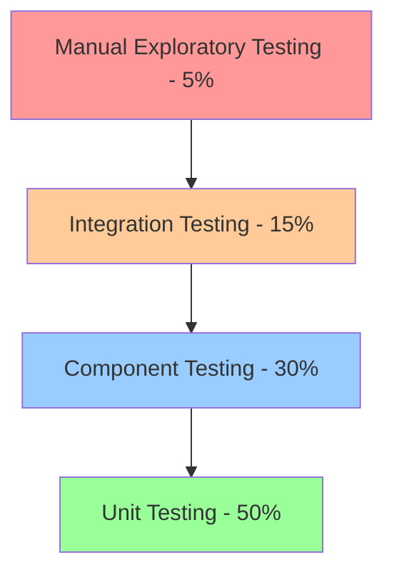
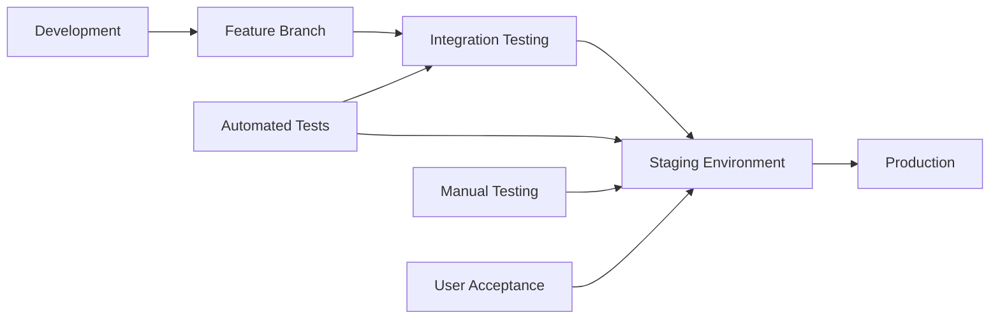

# CarMarket365 Translation System - Regression Testing Strategy

## Overview

This document defines the comprehensive regression testing strategy for the CarMarket365 translation system, ensuring ongoing quality assurance and preventing the reintroduction of previously resolved issues across all 6 supported languages and 33 pages.

## Regression Testing Objectives

### Primary Objectives
1. **Prevent Regression**: Ensure new changes don't break existing translation functionality
2. **Maintain Quality**: Preserve translation accuracy and consistency across releases
3. **Performance Stability**: Ensure system performance remains within acceptable limits
4. **Cross-Language Integrity**: Maintain functionality across all supported languages
5. **Browser Compatibility**: Ensure continued compatibility across all supported browsers

### Secondary Objectives
1. **Automation Efficiency**: Maximize automated test coverage to reduce manual effort
2. **Early Detection**: Identify issues early in the development cycle
3. **Risk Mitigation**: Reduce the risk of production issues through comprehensive testing
4. **Continuous Improvement**: Evolve testing strategy based on production feedback

## Regression Testing Framework

### Testing Pyramid Structure



#### Level 1: Unit Testing (50% of total tests)
**Focus**: Individual translation functions and utilities
**Frequency**: On every commit
**Tools**: Jest, Vitest
**Execution Time**: <2 minutes

**Coverage**:
- Translation key lookup functions
- Language detection utilities
- Translation validation functions
- Fallback mechanisms
- Performance utilities

#### Level 2: Component Testing (30% of total tests)
**Focus**: React components using translation system
**Frequency**: On every pull request
**Tools**: React Testing Library, Playwright Component Testing
**Execution Time**: <10 minutes

**Coverage**:
- useTranslation hook integration
- Component rendering with translations
- Language switching behavior
- Form components with translations
- Dynamic content rendering

#### Level 3: Integration Testing (15% of total tests)
**Focus**: Full application functionality across languages
**Frequency**: Daily/Pre-deployment
**Tools**: Playwright, Cypress
**Execution Time**: 30-60 minutes

**Coverage**:
- End-to-end user workflows
- Cross-page navigation
- Form submissions
- Language switching scenarios
- Browser compatibility

#### Level 4: Manual Exploratory Testing (5% of total tests)
**Focus**: User experience and edge cases
**Frequency**: Weekly/Pre-release
**Tools**: Manual testing, Checklists
**Execution Time**: 2-4 hours

**Coverage**:
- User experience validation
- Edge case scenarios
- Accessibility testing
- Visual regression testing
- Performance validation

## Automated Regression Testing

### Continuous Integration Pipeline

```yaml
# .github/workflows/translation-regression.yml
name: Translation System Regression Tests

on:
  push:
    branches: [main, develop]
  pull_request:
    branches: [main]
  schedule:
    - cron: '0 2 * * *'  # Daily at 2 AM UTC

jobs:
  unit-tests:
    name: Unit Tests
    runs-on: ubuntu-latest
    steps:
      - uses: actions/checkout@v3
      - uses: actions/setup-node@v3
        with:
          node-version: '18'
          cache: 'npm'
      
      - name: Install dependencies
        run: npm ci
        
      - name: Run unit tests
        run: npm run test:unit
        
      - name: Upload coverage
        uses: codecov/codecov-action@v3

  component-tests:
    name: Component Tests
    runs-on: ubuntu-latest
    needs: unit-tests
    steps:
      - uses: actions/checkout@v3
      - uses: actions/setup-node@v3
        with:
          node-version: '18'
          cache: 'npm'
          
      - name: Install dependencies
        run: npm ci
        
      - name: Run component tests
        run: npm run test:components
        
      - name: Run translation validation
        run: npm run test:translations

  integration-tests:
    name: Integration Tests
    runs-on: ubuntu-latest
    needs: component-tests
    strategy:
      matrix:
        browser: [chromium, firefox, webkit]
    steps:
      - uses: actions/checkout@v3
      - uses: actions/setup-node@v3
        with:
          node-version: '18'
          cache: 'npm'
          
      - name: Install dependencies
        run: npm ci
        
      - name: Install Playwright
        run: npx playwright install ${{ matrix.browser }}
        
      - name: Build application
        run: npm run build
        
      - name: Start server
        run: npm run preview &
        
      - name: Wait for server
        run: npx wait-on http://localhost:4173
        
      - name: Run integration tests
        run: npm run test:integration -- --project=${{ matrix.browser }}
        
      - name: Upload test results
        uses: actions/upload-artifact@v3
        if: failure()
        with:
          name: playwright-report-${{ matrix.browser }}
          path: playwright-report/

  performance-tests:
    name: Performance Regression Tests
    runs-on: ubuntu-latest
    needs: integration-tests
    steps:
      - uses: actions/checkout@v3
      - uses: actions/setup-node@v3
        with:
          node-version: '18'
          cache: 'npm'
          
      - name: Install dependencies
        run: npm ci
        
      - name: Build application
        run: npm run build
        
      - name: Start server
        run: npm run preview &
        
      - name: Run performance tests
        run: npm run test:performance
        
      - name: Performance regression check
        run: npm run test:performance:compare

  accessibility-tests:
    name: Accessibility Regression Tests
    runs-on: ubuntu-latest
    needs: integration-tests
    steps:
      - uses: actions/checkout@v3
      - uses: actions/setup-node@v3
        with:
          node-version: '18'
          cache: 'npm'
          
      - name: Install dependencies
        run: npm ci
        
      - name: Build application
        run: npm run build
        
      - name: Start server
        run: npm run preview &
        
      - name: Run accessibility tests
        run: npm run test:a11y
```

### Test Categories and Schedules

#### Daily Automated Tests (2 AM UTC)
1. **Translation Key Validation**
   - Verify all translation keys exist
   - Check for missing or empty translations
   - Validate TypeScript interfaces

2. **Cross-Browser Smoke Tests**
   - Basic functionality in Chrome, Firefox, Safari
   - Language switching capability
   - Form submission tests

3. **Performance Baseline Tests**
   - Page load time measurements
   - Memory usage validation
   - Translation lookup performance

#### Weekly Automated Tests (Sundays 3 AM UTC)
1. **Comprehensive Cross-Browser Testing**
   - Full test suite on all supported browsers
   - Mobile browser testing
   - Device-specific testing

2. **Accessibility Compliance Testing**
   - WCAG 2.1 compliance validation
   - Screen reader compatibility
   - Keyboard navigation testing

3. **Performance Regression Analysis**
   - Detailed performance profiling
   - Memory leak detection
   - Bundle size analysis

#### Pre-Release Testing (On-Demand)
1. **Full Regression Suite**
   - Complete test coverage
   - Manual exploratory testing
   - User acceptance testing simulation

## Test Data Management

### Translation Test Data Strategy

#### Static Test Data
- **Reference Translations**: Verified correct translations for testing
- **Edge Case Data**: Extreme length translations, special characters
- **Invalid Data**: Malformed keys, missing translations
- **Performance Data**: Large volume translation sets

#### Dynamic Test Data Generation
```typescript
// test-data-generator.ts
export class TranslationTestDataGenerator {
  generateTestKeys(count: number): string[] {
    // Generate random but valid translation keys
  }
  
  generateLongTranslations(): Record<string, string> {
    // Generate extremely long translations for layout testing
  }
  
  generateSpecialCharacterTranslations(): Record<string, string> {
    // Generate translations with Unicode, emoji, RTL text
  }
  
  generatePerformanceTestData(keyCount: number): TranslationStrings {
    // Generate large translation datasets for performance testing
  }
}
```

#### Test Data Refresh Strategy
- **Daily**: Update dynamic test content
- **Weekly**: Refresh edge case scenarios
- **Monthly**: Update reference translations from production
- **On-Demand**: Generate specific test scenarios for bug reproduction

## Browser and Device Testing Matrix

### Supported Browser Matrix
| Browser | Desktop Versions | Mobile Versions | Testing Frequency |
|---------|------------------|-----------------|-------------------|
| Chrome | Latest, Latest-1, Latest-2 | Latest, Latest-1 | Daily |
| Firefox | Latest, Latest-1 | Latest, Latest-1 | Daily |
| Safari | Latest, Latest-1 | Latest, Latest-1 | Daily |
| Edge | Latest, Latest-1 | N/A | Weekly |

### Device Testing Matrix
| Device Category | Resolutions | Testing Frequency |
|-----------------|-------------|-------------------|
| Desktop | 1920x1080, 1366x768, 2560x1440 | Daily |
| Tablet | 768x1024, 1024x768, 834x1194 | Weekly |
| Mobile | 375x812, 414x896, 360x640 | Daily |

### Operating System Coverage
- **Windows**: Windows 10, Windows 11
- **macOS**: Monterey, Ventura, Sonoma
- **Linux**: Ubuntu LTS (CI/CD environment)
- **iOS**: iOS 16, iOS 17
- **Android**: Android 12, Android 13, Android 14

## Performance Regression Testing

### Performance Baseline Metrics
```javascript
// performance-baselines.js
export const performanceBaselines = {
  pageLoad: {
    homepage: { target: 1200, alert: 1800 }, // milliseconds
    browseCars: { target: 1800, alert: 2400 },
    carDetail: { target: 1400, alert: 2000 },
    sellCar: { target: 1600, alert: 2200 }
  },
  
  translationLookup: {
    average: { target: 0.5, alert: 2.0 }, // milliseconds
    complex: { target: 1.0, alert: 5.0 }
  },
  
  memoryUsage: {
    baseline: { target: 25, alert: 40 }, // MB
    afterTranslations: { target: 30, alert: 50 }
  },
  
  bundleSize: {
    main: { target: 500, alert: 750 }, // KB
    translations: { target: 100, alert: 200 }
  }
};
```

### Performance Test Automation
```typescript
// performance-regression-test.ts
export class PerformanceRegressionTester {
  async runPerformanceBaseline(): Promise<PerformanceReport> {
    const results = await Promise.all([
      this.measurePageLoadTimes(),
      this.measureTranslationPerformance(),
      this.measureMemoryUsage(),
      this.analyzeBundleSize()
    ]);
    
    return this.generatePerformanceReport(results);
  }
  
  async compareWithBaseline(current: PerformanceReport): Promise<RegressionResult> {
    const baseline = await this.loadBaselineMetrics();
    return this.analyzeDifferences(baseline, current);
  }
}
```

### Performance Alert Thresholds
- **Page Load Time**: Alert if >20% increase from baseline
- **Translation Lookup**: Alert if >50% increase from baseline
- **Memory Usage**: Alert if >25% increase from baseline
- **Bundle Size**: Alert if >15% increase from baseline

## Visual Regression Testing

### Visual Testing Strategy
```yaml
# visual-regression.yml
name: Visual Regression Tests

on:
  pull_request:
    paths:
      - 'src/**'
      - 'shared/translations/**'

jobs:
  visual-tests:
    runs-on: ubuntu-latest
    steps:
      - uses: actions/checkout@v3
      
      - name: Setup and build
        run: |
          npm ci
          npm run build
          npm run preview &
          
      - name: Run visual regression tests
        uses: lost-pixel/lost-pixel@v3.16.0
        env:
          LOST_PIXEL_PROJECT_ID: ${{ secrets.LOST_PIXEL_PROJECT_ID }}
          LOST_PIXEL_API_KEY: ${{ secrets.LOST_PIXEL_API_KEY }}
```

### Visual Test Coverage
1. **Key Pages**: Homepage, Browse Cars, Car Detail, Sell Car, About, Contact, FAQ
2. **Languages**: All 6 supported languages
3. **Viewports**: Desktop, tablet, mobile
4. **Scenarios**: 
   - Initial page load
   - After language switch
   - Form states (empty, filled, error)
   - Modal dialogs and overlays

### Visual Baseline Management
- **Baseline Updates**: After approved UI changes
- **Review Process**: Visual diff review required for changes
- **Threshold Settings**: Configurable pixel difference thresholds
- **Failure Handling**: Automatic PR comments with visual diffs

## Test Environment Management

### Environment Strategy


#### Development Environment
- **Purpose**: Initial development and unit testing
- **Translation Data**: Latest development translations
- **Testing**: Unit and component tests
- **Refresh**: On every commit

#### Integration Testing Environment
- **Purpose**: Automated integration testing
- **Translation Data**: Stable test dataset
- **Testing**: Cross-browser and performance tests
- **Refresh**: Daily

#### Staging Environment
- **Purpose**: Pre-production validation
- **Translation Data**: Production-like data
- **Testing**: Manual testing and user acceptance
- **Refresh**: Before each release

#### Production Environment
- **Purpose**: Live system monitoring
- **Translation Data**: Production translations
- **Testing**: Synthetic monitoring and real user monitoring
- **Refresh**: Continuous

### Environment Configuration Management
```typescript
// environment-config.ts
export interface TestEnvironmentConfig {
  baseUrl: string;
  translationSource: 'development' | 'staging' | 'production';
  testDataRefresh: 'always' | 'daily' | 'weekly' | 'manual';
  monitoringEnabled: boolean;
  performanceBaselines: PerformanceBaselines;
}

export const environments: Record<string, TestEnvironmentConfig> = {
  development: {
    baseUrl: 'http://localhost:5173',
    translationSource: 'development',
    testDataRefresh: 'always',
    monitoringEnabled: false,
    performanceBaselines: developmentBaselines
  },
  
  integration: {
    baseUrl: 'https://integration.carmarket365.com',
    translationSource: 'staging',
    testDataRefresh: 'daily',
    monitoringEnabled: true,
    performanceBaselines: integrationBaselines
  },
  
  staging: {
    baseUrl: 'https://staging.carmarket365.com',
    translationSource: 'production',
    testDataRefresh: 'weekly',
    monitoringEnabled: true,
    performanceBaselines: productionBaselines
  }
};
```

## Risk-Based Testing Prioritization

### Risk Assessment Matrix
| Risk Factor | High Impact Areas | Testing Priority |
|-------------|-------------------|------------------|
| **Critical Business Functions** | Car search, listing creation, contact forms | P0 - Daily |
| **High-Traffic Pages** | Homepage, browse cars, car detail | P1 - Daily |
| **Revenue-Critical Features** | Dealer registration, payment flows | P0 - Daily |
| **Legal Compliance** | Privacy policy, terms of service, accessibility | P1 - Weekly |
| **New Features** | Recently implemented functionality | P0 - Daily |

### Test Prioritization Algorithm
```typescript
interface TestPriority {
  businessImpact: 'critical' | 'high' | 'medium' | 'low';
  changeFrequency: 'high' | 'medium' | 'low';
  userImpact: 'high' | 'medium' | 'low';
  technicalComplexity: 'high' | 'medium' | 'low';
}

function calculateTestPriority(test: TestPriority): number {
  const weights = {
    businessImpact: { critical: 4, high: 3, medium: 2, low: 1 },
    changeFrequency: { high: 3, medium: 2, low: 1 },
    userImpact: { high: 3, medium: 2, low: 1 },
    technicalComplexity: { high: 2, medium: 1.5, low: 1 }
  };
  
  return (
    weights.businessImpact[test.businessImpact] * 0.4 +
    weights.changeFrequency[test.changeFrequency] * 0.25 +
    weights.userImpact[test.userImpact] * 0.25 +
    weights.technicalComplexity[test.technicalComplexity] * 0.1
  );
}
```

## Test Maintenance Strategy

### Test Suite Health Monitoring
```typescript
interface TestSuiteMetrics {
  totalTests: number;
  passingTests: number;
  failingTests: number;
  flakyTests: number;
  executionTime: number;
  coverage: number;
  lastUpdated: Date;
}

class TestSuiteHealthMonitor {
  async generateHealthReport(): Promise<TestSuiteHealthReport> {
    return {
      overall: await this.calculateOverallHealth(),
      trends: await this.analyzeTrends(),
      recommendations: await this.generateRecommendations(),
      maintenance: await this.identifyMaintenanceNeeds()
    };
  }
}
```

### Automated Test Maintenance
1. **Dead Code Detection**: Remove unused test code
2. **Flaky Test Identification**: Identify and fix unstable tests
3. **Coverage Analysis**: Ensure adequate test coverage
4. **Performance Monitoring**: Monitor test execution times
5. **Dependency Updates**: Keep testing frameworks updated

### Test Review Process
- **Weekly**: Review test failures and flaky tests
- **Monthly**: Analyze test coverage and performance
- **Quarterly**: Review and update test strategy
- **Annually**: Major framework updates and strategy overhaul

## Monitoring and Alerting

### Test Execution Monitoring
```typescript
interface TestExecutionAlert {
  type: 'failure' | 'performance' | 'coverage' | 'maintenance';
  severity: 'critical' | 'high' | 'medium' | 'low';
  message: string;
  actionRequired: string;
  assignee: string;
}

class TestMonitoringService {
  async monitorTestExecution(): Promise<TestExecutionAlert[]> {
    const alerts: TestExecutionAlert[] = [];
    
    // Check for test failures
    if (await this.hasCriticalTestFailures()) {
      alerts.push({
        type: 'failure',
        severity: 'critical',
        message: 'Critical translation tests failing',
        actionRequired: 'Immediate investigation required',
        assignee: 'on-call-engineer'
      });
    }
    
    // Check performance degradation
    if (await this.hasPerformanceRegression()) {
      alerts.push({
        type: 'performance',
        severity: 'high',
        message: 'Translation performance regression detected',
        actionRequired: 'Performance analysis needed',
        assignee: 'performance-team'
      });
    }
    
    return alerts;
  }
}
```

### Alert Channels
- **Slack**: Real-time notifications for test failures
- **Email**: Daily digest of test results
- **Dashboard**: Visual representation of test health
- **PagerDuty**: Critical issue escalation

## Success Metrics and KPIs

### Key Performance Indicators
1. **Test Coverage**: >95% code coverage for translation system
2. **Test Pass Rate**: >98% for all automated tests
3. **Mean Time to Detection**: <2 hours for critical issues
4. **Mean Time to Resolution**: <24 hours for critical issues
5. **False Positive Rate**: <5% for automated tests

### Quality Metrics
1. **Translation Accuracy**: >99% accuracy in production
2. **Performance Regression**: <5% performance impact from changes
3. **Browser Compatibility**: 100% core functionality across supported browsers
4. **Accessibility Compliance**: WCAG 2.1 AA compliance maintained

### Efficiency Metrics
1. **Automation Rate**: >90% of regression tests automated
2. **Test Execution Time**: <30 minutes for full regression suite
3. **Environment Stability**: >99% test environment uptime
4. **Test Maintenance Overhead**: <10% of total QA effort

## Continuous Improvement Process

### Monthly Review Process
1. **Metrics Analysis**: Review all KPIs and identify trends
2. **Test Effectiveness Review**: Analyze test failure patterns
3. **Process Optimization**: Identify bottlenecks and inefficiencies
4. **Tool Evaluation**: Assess need for new tools or upgrades
5. **Team Feedback**: Collect input from development and QA teams

### Quarterly Strategy Review
1. **Strategy Alignment**: Ensure testing strategy supports business goals
2. **Technology Updates**: Evaluate new testing technologies
3. **Process Improvements**: Implement identified improvements
4. **Training Needs**: Assess team training requirements
5. **Resource Planning**: Plan for future testing resource needs

### Annual Strategy Overhaul
1. **Complete Strategy Review**: Comprehensive review of entire strategy
2. **Industry Best Practices**: Research and adopt industry standards
3. **Tool Migration Planning**: Plan for major tool upgrades
4. **Skill Development**: Identify long-term skill development needs
5. **Budget Planning**: Annual budget planning for testing tools and resources

This comprehensive regression testing strategy ensures the CarMarket365 translation system maintains high quality and reliability across all supported languages, browsers, and devices while providing efficient, automated testing processes that scale with the platform's growth.