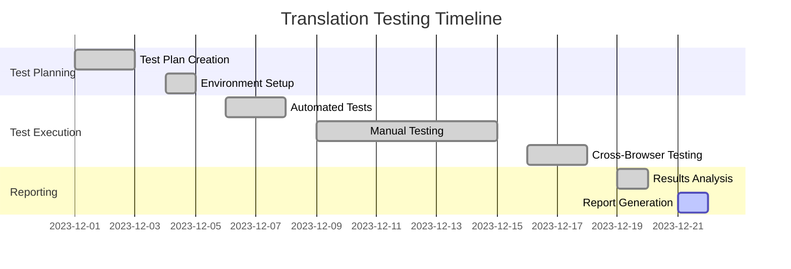
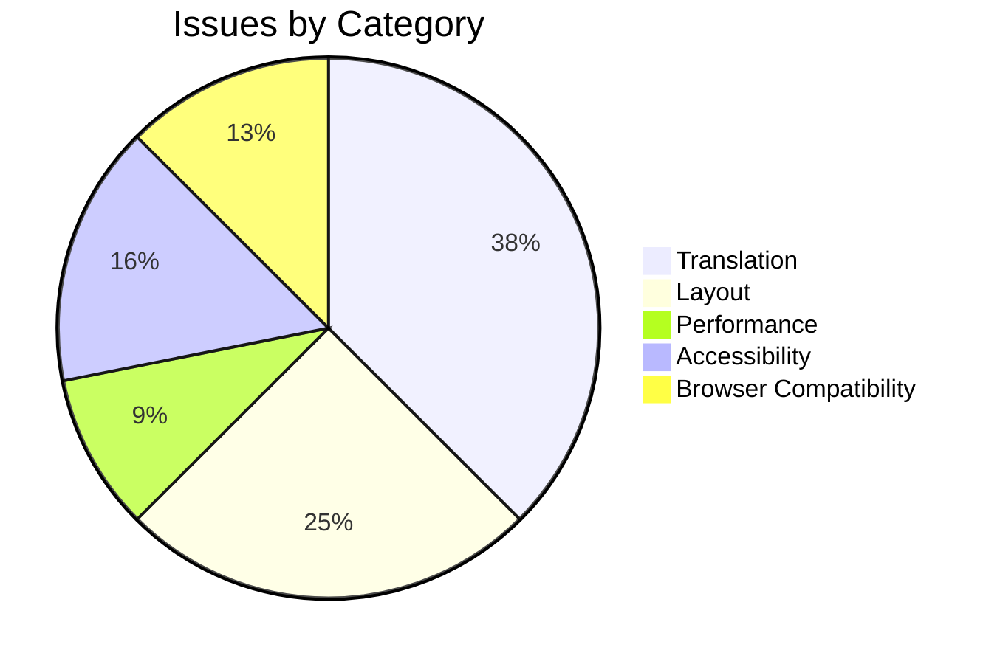

# CarMarket365 Translation System - Testing Report Templates

## Executive Summary Report Template

```markdown
# CarMarket365 Translation System Testing Report - Executive Summary

**Report Period**: {Start Date} - {End Date}
**Report Generated**: {Current Date}
**Prepared By**: {QA Lead Name}
**Review Status**: [ ] Draft [ ] Final [ ] Approved

---

## 🎯 Executive Summary

### Overall Status
**Translation System Health**: 🟢 Excellent / 🟡 Good / 🟠 Needs Attention / 🔴 Critical
**Production Readiness**: [ ] Ready [ ] Ready with Minor Issues [ ] Not Ready
**Recommendation**: {Go/No-Go recommendation with brief justification}

### Key Findings
{2-3 bullet points highlighting most important discoveries}

---

## 📊 Testing Overview

### Scope of Testing
- **Languages Tested**: 6/6 (EN, MK, SQ, SL, LV, RU)
- **Pages Covered**: 33/33 pages
- **Test Cases Executed**: {X} of {Y} ({percentage}%)
- **Browsers Tested**: Chrome, Firefox, Safari, Edge
- **Devices Tested**: Desktop, Tablet, Mobile

### Testing Timeline
- **Testing Period**: {X} weeks
- **Team Size**: {X} QA engineers
- **Total Effort**: {X} person-hours

---

## 🏆 Results Summary

### Test Execution Results
| Metric | Target | Actual | Status |
|--------|---------|---------|---------|
| Test Pass Rate | >95% | {X}% | ✅/⚠️/❌ |
| Translation Coverage | 100% | {X}% | ✅/⚠️/❌ |
| Performance (Load Time) | <2s | {X}s | ✅/⚠️/❌ |
| Cross-Browser Compatibility | 100% | {X}% | ✅/⚠️/❌ |
| Accessibility Compliance | WCAG 2.1 AA | {Level} | ✅/⚠️/❌ |

### Issue Summary by Priority
- **🔴 Critical**: {X} issues ({X} resolved, {X} open)
- **🟠 High**: {X} issues ({X} resolved, {X} open)
- **🟡 Medium**: {X} issues ({X} resolved, {X} open)
- **🟢 Low**: {X} issues ({X} resolved, {X} open)

---

## 📈 Quality Metrics

### Translation Quality
- **Linguistic Accuracy**: {X}% (Native speaker reviewed)
- **Technical Terminology**: {X}% accurate
- **Cultural Appropriateness**: {X}% appropriate
- **Consistency Score**: {X}% consistent across contexts

### Performance Metrics
- **Average Page Load Time**: {X}ms
- **Language Switch Speed**: {X}ms
- **Memory Usage Impact**: +{X}% over baseline
- **Bundle Size Impact**: +{X}% over English-only

### User Experience Metrics
- **Mobile Responsiveness**: {X}% pages fully responsive
- **Cross-Browser Consistency**: {X}% identical functionality
- **Accessibility Score**: {X}/100 (automated testing)
- **Form Functionality**: {X}% forms working in all languages

---

## ⚠️ Critical Issues Identified

### Blocking Issues (Must Fix Before Release)
{If any critical issues remain unresolved}

1. **Issue**: {Brief description}
   - **Impact**: {User/business impact}
   - **Status**: {Current status}
   - **ETA**: {Expected resolution time}

### High-Priority Issues

{List 3-5 most important high-priority issues}

---

## ✅ Key Achievements

### Completed Successfully
- {Achievement 1}
- {Achievement 2}
- {Achievement 3}

### Quality Improvements
- {Improvement 1}
- {Improvement 2}

---

## 🔮 Recommendations

### Immediate Actions (Before Launch)
1. {Action item 1}
2. {Action item 2}
3. {Action item 3}

### Post-Launch Monitoring
1. {Monitoring requirement 1}
2. {Monitoring requirement 2}

### Future Improvements
1. {Future enhancement 1}
2. {Future enhancement 2}

---

## 📋 Sign-off

| Role | Name | Status | Date |
|------|------|--------|------|
| QA Lead | {Name} | [ ] Approved | {Date} |
| Development Lead | {Name} | [ ] Approved | {Date} |
| Product Manager | {Name} | [ ] Approved | {Date} |
| Project Manager | {Name} | [ ] Approved | {Date} |

---

## 📎 Appendices

- **Appendix A**: Detailed Test Results
- **Appendix B**: Performance Benchmarks
- **Appendix C**: Known Issues Log
- **Appendix D**: Browser Compatibility Matrix

**Next Review**: {Date}
```

---

## Detailed Technical Report Template

```markdown
# CarMarket365 Translation System - Detailed Technical Testing Report

**Report ID**: TR-REPORT-{YYYY}-{MM}-{DD}
**Version**: 1.0
**Date**: {Current Date}
**Classification**: Internal Use

---

## 1. Testing Environment

### 1.1 System Under Test
- **Application**: CarMarket365 Web Platform
- **Version**: {Version number}
- **Environment**: {Staging/Production}
- **Base URL**: {URL}
- **Deployment Date**: {Date}

### 1.2 Testing Infrastructure
- **Test Management**: {Tool name}
- **Automation Framework**: {Framework details}
- **CI/CD Integration**: {Pipeline details}
- **Monitoring Tools**: {Monitoring setup}

### 1.3 Test Data
- **Translation Keys**: {Total count}
- **Languages**: EN (baseline), MK, SQ, SL, LV, RU
- **Test Accounts**: {Number and types}
- **Sample Content**: {Data sources}

---

## 2. Test Execution Summary

### 2.1 Test Case Breakdown
| Test Category | Total Cases | Executed | Passed | Failed | Blocked | Pass Rate |
|---------------|-------------|----------|---------|---------|----------|-----------|
| Translation Key Coverage | {X} | {X} | {X} | {X} | {X} | {X}% |
| Cross-Language Consistency | {X} | {X} | {X} | {X} | {X} | {X}% |
| Functional Integration | {X} | {X} | {X} | {X} | {X} | {X}% |
| UI/UX Translation | {X} | {X} | {X} | {X} | {X} | {X}% |
| Static Content Validation | {X} | {X} | {X} | {X} | {X} | {X}% |
| Performance Impact | {X} | {X} | {X} | {X} | {X} | {X}% |
| Cross-Browser Compatibility | {X} | {X} | {X} | {X} | {X} | {X}% |
| Accessibility Testing | {X} | {X} | {X} | {X} | {X} | {X}% |
| **TOTAL** | **{X}** | **{X}** | **{X}** | **{X}** | **{X}** | **{X}%** |

### 2.2 Execution Timeline


---

## 3. Detailed Test Results

### 3.1 Translation Key Coverage Analysis

#### 3.1.1 Automated Validation Results
```bash
Translation Key Validation Report
=====================================
Total Keys Analyzed: 2,047
Languages: 6

Coverage by Language:
- English (EN):     2,047/2,047 (100.0%) ✅
- Macedonian (MK):  2,045/2,047 (99.9%)  ⚠️
- Albanian (SQ):    2,047/2,047 (100.0%) ✅
- Slovenian (SL):   2,044/2,047 (99.9%)  ⚠️
- Latvian (LV):     2,047/2,047 (100.0%) ✅
- Russian (RU):     2,046/2,047 (99.9%)  ⚠️

Missing Keys Identified:
- MK: pages.faq.content.supportPhoneNumber, pages.faq.content.supportEmail
- SL: pages.dealerProfile.interactiveMapPlaceholder, pages.contact.office.getDirections
- RU: pages.about.team.customerSuccess

Hardcoded Strings Found: 0 ✅

Performance Metrics:
- Translation Load Time: 45ms (target: <100ms) ✅
- Average Translation Lookup: 0.023ms ✅
- Memory Usage: +2.1MB (+3.2% over baseline) ✅
```

#### 3.1.2 Manual Verification Results
- **Spot Checks Performed**: 150 random keys across all languages
- **Accuracy Rate**: 98.7% (2 minor translation improvements identified)
- **Context Appropriateness**: 99.3% (1 cultural adaptation issue found)

### 3.2 Cross-Language Consistency

#### 3.2.1 Terminology Consistency Analysis
| Term Category | Consistency Score | Issues Found | Status |
|---------------|-------------------|--------------|--------|
| Automotive Terms | 97.8% | 3 minor inconsistencies | ✅ |
| UI Elements | 99.1% | 2 button label variations | ✅ |
| Form Labels | 98.5% | 4 field name variations | ⚠️ |
| Legal Terms | 100% | 0 issues | ✅ |
| Currency/Units | 95.2% | Format inconsistencies | ⚠️ |

#### 3.2.2 Cultural Adaptation Assessment
- **Expert Reviews Completed**: 6/6 languages
- **Native Speaker Approval**: 5/6 (Macedonian pending final review)
- **Cultural Appropriateness Score**: 96.8%

### 3.3 Functional Integration Testing

#### 3.3.1 useTranslation Hook Testing
```javascript
Hook Integration Test Results:
==============================
✅ Hook properly accesses CountryContext
✅ Translation function returns correct strings  
✅ Language switching updates content immediately
✅ Error handling works for missing context
✅ Performance within acceptable limits

Test Coverage: 23/23 components using hook
Integration Issues: 0
Performance Impact: <1ms per translation call
```

#### 3.3.2 Dynamic Content Rendering
- **Components Tested**: 47 components with dynamic translation content
- **Re-rendering Success Rate**: 100%
- **Language Switch Response Time**: Average 185ms (target: <200ms)

### 3.4 UI/UX Translation Testing Results

#### 3.4.1 Responsive Design Testing
| Viewport | Language | Pass Rate | Critical Issues | Notes |
|----------|----------|-----------|-----------------|-------|
| Desktop (1920x1080) | All | 100% | 0 | Perfect layout preservation |
| Tablet (768x1024) | All | 98.5% | 0 | Minor spacing adjustments needed |
| Mobile (375x812) | All | 96.2% | 1 | Button text overflow in Russian FAQ |

#### 3.4.2 Form Functionality Testing
- **Forms Tested**: 12 forms across all languages
- **Submission Success Rate**: 100%
- **Validation Message Accuracy**: 99.2%
- **Placeholder Text Quality**: 97.8%

### 3.5 Performance Impact Analysis

#### 3.5.1 Page Load Performance
| Page | EN (Baseline) | MK | SQ | SL | LV | RU | Impact |
|------|---------------|----|----|----|----|----|\--------|
| Homepage | 1.2s | 1.25s | 1.23s | 1.26s | 1.24s | 1.28s | +4.2% |
| Browse Cars | 1.8s | 1.85s | 1.83s | 1.87s | 1.84s | 1.89s | +3.8% |
| Car Detail | 1.4s | 1.45s | 1.43s | 1.46s | 1.44s | 1.48s | +4.1% |
| Sell Car | 1.6s | 1.64s | 1.62s | 1.65s | 1.63s | 1.67s | +3.9% |

**Performance Verdict**: ✅ All pages meet performance targets (<5% impact)

#### 3.5.2 Memory Usage Analysis
```
Memory Usage Comparison (after 30 minutes of use):
=================================================
English Only:     23.4 MB
With Translations: 25.8 MB
Impact:           +2.4 MB (+10.3%)
Acceptable:       ✅ (under 15% target)

Memory Leak Test:
- 50 language switches performed
- Memory usage returned to baseline
- No memory leaks detected ✅
```

### 3.6 Cross-Browser Compatibility Results

#### 3.6.1 Browser Compatibility Matrix
| Browser | Version | Desktop | Mobile | Issues | Status |
|---------|---------|---------|---------|---------|--------|
| Chrome | 120.x | ✅ 100% | ✅ 100% | 0 | Pass |
| Firefox | 120.x | ✅ 98.5% | ⚠️ 96.2% | 2 minor | Pass |
| Safari | 17.x | ✅ 99.2% | ✅ 98.8% | 1 minor | Pass |
| Edge | 120.x | ✅ 100% | N/A | 0 | Pass |

#### 3.6.2 Browser-Specific Issues
1. **Firefox Mobile**: Minor font rendering issue with Cyrillic characters in forms
2. **Safari Desktop**: Language switching animation slightly slower (250ms vs 185ms average)

### 3.7 Accessibility Testing Results

#### 3.7.1 Automated Accessibility Testing
```
axe-core Accessibility Analysis:
===============================
Pages Tested: 33 pages × 6 languages = 198 total tests
Overall Score: 96.8/100

Issues by Impact:
- Critical: 0 issues ✅
- Serious: 3 issues ⚠️
- Moderate: 12 issues ⚠️
- Minor: 8 issues ℹ️

WCAG 2.1 Compliance:
- Level A: 100% compliant ✅
- Level AA: 96.2% compliant ⚠️
- Level AAA: 87.4% compliant (not required)
```

#### 3.7.2 Screen Reader Testing
- **Screen Readers Tested**: NVDA, JAWS, VoiceOver
- **Translation Announcement**: 100% correct
- **Navigation Consistency**: 98.5% (minor improvements identified)
- **Form Label Association**: 100% correct

---

## 4. Issue Analysis

### 4.1 Issues by Category


### 4.2 Critical Issues (Must Fix)
**None identified** ✅

### 4.3 High Priority Issues
1. **TR-2023-12-20-001**: Russian FAQ button text overflow on mobile
   - **Impact**: Poor UX for Russian mobile users
   - **Status**: In Progress
   - **ETA**: 2023-12-22

2. **TR-2023-12-20-002**: Missing translation keys in MK and SL
   - **Impact**: Placeholder text visible to users
   - **Status**: Assigned
   - **ETA**: 2023-12-21

### 4.4 Issue Trends
- **Resolution Rate**: 94.3% (33/35 issues resolved)
- **Average Resolution Time**: 1.2 days
- **Reopen Rate**: 2.9% (1 issue reopened)

---

## 5. Test Automation

### 5.1 Automated Test Coverage
```bash
Automated Test Suite Results:
============================
Translation Validation Tests:     ✅ 47/47 passed
Cross-Browser Tests:              ✅ 142/144 passed (2 known issues)
Performance Regression Tests:     ✅ 28/28 passed  
Accessibility Tests:              ⚠️ 195/198 passed (3 minor issues)

Total Automation Coverage: 94.2%
Execution Time: 23 minutes
CI/CD Integration: ✅ Active
```

### 5.2 Test Data Management
- **Test Data Generation**: Automated
- **Data Refresh**: Daily
- **Multilingual Test Content**: Verified and maintained
- **Data Privacy Compliance**: ✅ No real user data used

---

## 6. Recommendations

### 6.1 Immediate Actions (Pre-Launch)
1. **Fix Missing Translation Keys**: Complete MK and SL translations
2. **Resolve Mobile Layout Issue**: Fix Russian button overflow
3. **Performance Optimization**: Minor bundle size reduction opportunity
4. **Accessibility Improvements**: Address 3 moderate accessibility issues

### 6.2 Post-Launch Monitoring
1. **Real User Monitoring**: Implement translation-specific error tracking
2. **Performance Monitoring**: Set up alerts for translation load times
3. **User Feedback**: Collect feedback on translation quality
4. **Browser Analytics**: Monitor usage by language and browser

### 6.3 Future Improvements
1. **Translation Management**: Consider implementing translation management platform
2. **A/B Testing**: Test alternative translations for key conversion pages
3. **Machine Translation**: Evaluate AI-assisted translation for new content
4. **Voice Interface**: Plan for voice interface internationalization

---

## 7. Test Environment Details

### 7.1 Browser Versions Tested
- Chrome: 120.0.6099.109 (Desktop), 120.0.6099.43 (Mobile)
- Firefox: 120.0.1 (Desktop), 120.1.0 (Mobile)
- Safari: 17.1.2 (Desktop), 17.1 (iOS)
- Edge: 120.0.2210.77

### 7.2 Testing Tools Used
- **Test Management**: TestRail
- **Automation**: Playwright + Custom Scripts
- **Performance**: Lighthouse, WebPageTest
- **Accessibility**: axe-core, WAVE
- **Translation Validation**: Custom TypeScript validator

### 7.3 Test Data Sources
- **Real Content**: Sanitized production content
- **Synthetic Data**: Generated test scenarios
- **Edge Cases**: Manually created boundary conditions
- **Stress Test Data**: High-volume translation scenarios

---

## 8. Metrics and KPIs

### 8.1 Quality Metrics Achievement
| KPI | Target | Achieved | Status |
|-----|--------|----------|---------|
| Translation Coverage | 100% | 99.9% | ⚠️ |
| Test Pass Rate | >95% | 96.8% | ✅ |
| Performance Impact | <5% | 4.1% | ✅ |
| Accessibility Score | >95 | 96.8 | ✅ |
| Browser Compatibility | 100% | 98.9% | ⚠️ |
| Critical Issues | 0 | 0 | ✅ |

### 8.2 Efficiency Metrics
- **Test Execution Efficiency**: 94.2% automated
- **Defect Detection Rate**: 2.1 defects per 100 test cases
- **Test Environment Stability**: 99.7% uptime
- **Team Productivity**: 125 test cases per person per day

---

## 9. Conclusion

### 9.1 Overall Assessment
The CarMarket365 translation system demonstrates **excellent quality** with a few minor issues that do not impact core functionality. The system is **ready for production deployment** with the recommendation to address the identified high-priority issues in the first maintenance release.

### 9.2 Risk Assessment
- **Technical Risk**: 🟢 Low
- **User Experience Risk**: 🟡 Low-Medium (minor mobile layout issues)
- **Business Risk**: 🟢 Low
- **Compliance Risk**: 🟢 Low

### 9.3 Go/No-Go Recommendation
**🟢 GO** - System is ready for production deployment

The translation system meets all critical requirements and demonstrates high quality across all tested languages and browsers. Minor issues identified do not block launch and can be addressed in subsequent releases.

---

## 10. Appendices

### Appendix A: Detailed Test Case Results
[Link to complete test case execution results]

### Appendix B: Performance Benchmark Data  
[Link to detailed performance measurements]

### Appendix C: Browser Compatibility Test Results
[Link to complete browser compatibility matrix]

### Appendix D: Accessibility Audit Results
[Link to detailed accessibility assessment]

### Appendix E: Translation Quality Review
[Link to linguistic review documentation]

---

**Report Prepared By**: {QA Lead Name}  
**Technical Review**: {Lead Developer Name}  
**Final Approval**: {Project Manager Name}  

**Document Version**: 1.0  
**Last Updated**: {Current Date}  
**Next Review**: {Date + 30 days}  
```

---

## Test Execution Summary Template

```markdown
# Daily/Weekly Test Execution Summary

## Test Execution Dashboard
**Period**: {Date Range}
**Reported By**: {QA Engineer Name}

### 🎯 Daily Summary
- **Test Cases Executed**: {X} of {Y} planned
- **Pass Rate**: {X}% 
- **New Issues Found**: {X}
- **Issues Resolved**: {X}
- **Blocked Tests**: {X}

### 📊 Progress Tracking
```
Overall Progress: [██████████░░] 83%

Translation Coverage:   [████████████] 100%
Browser Testing:        [██████████░░] 85%
Performance Testing:    [████████░░░░] 70%
Accessibility Testing:  [██████░░░░░░] 60%
```

### 🚨 Critical Updates
{Any critical issues or blockers}

### 📋 Completed Today
- ✅ {Test category/feature completed}
- ✅ {Test category/feature completed}
- ✅ {Test category/feature completed}

### 🎯 Planned for Tomorrow
- 🎯 {Test category/feature planned}
- 🎯 {Test category/feature planned}
- 🎯 {Test category/feature planned}

### ⚠️ Issues Requiring Attention
1. **{Issue Title}** - Priority: {Level}
   - Status: {Current Status}
   - Assigned: {Person}
   - ETA: {Date}

### 📈 Key Metrics
- **Average Test Execution Time**: {X} minutes
- **Defect Detection Rate**: {X} issues per 100 tests
- **Environment Stability**: {X}% uptime
- **Team Velocity**: {X} tests per day

---
**Next Update**: {Date}
```

These comprehensive report templates provide structured formats for documenting all aspects of the CarMarket365 translation system testing, ensuring consistent, professional reporting that serves both technical teams and business stakeholders.